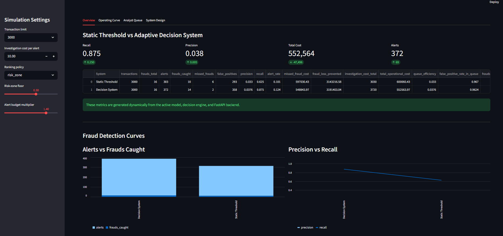
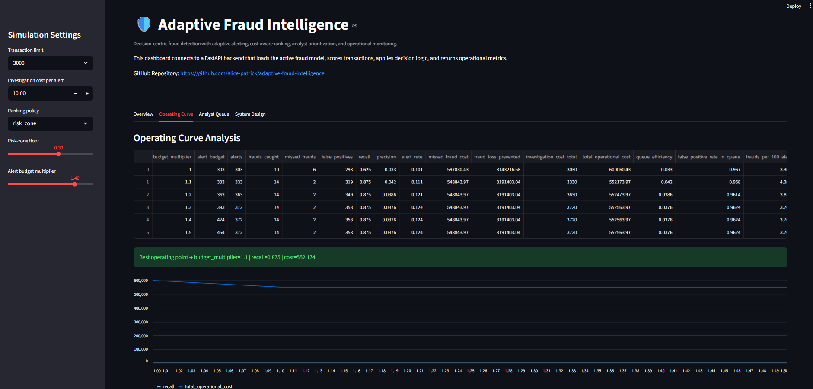
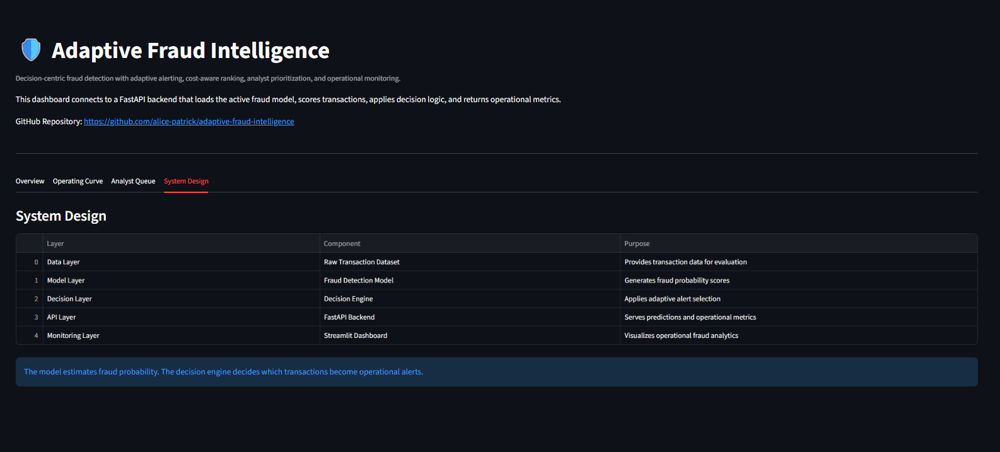
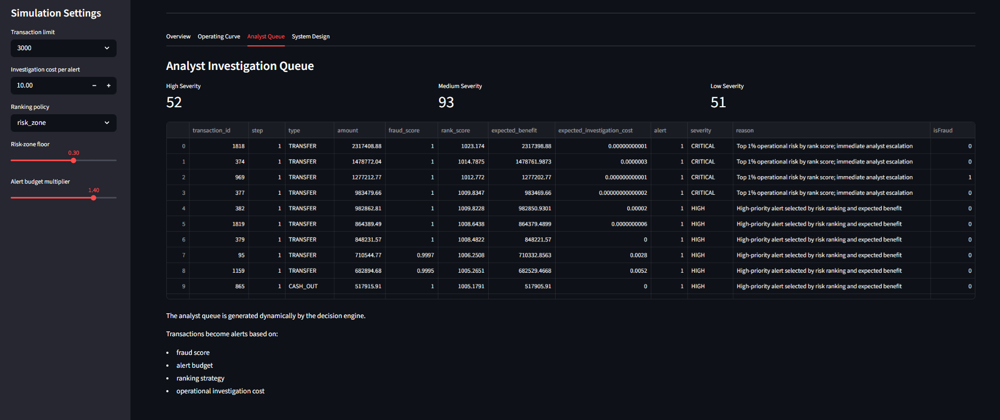
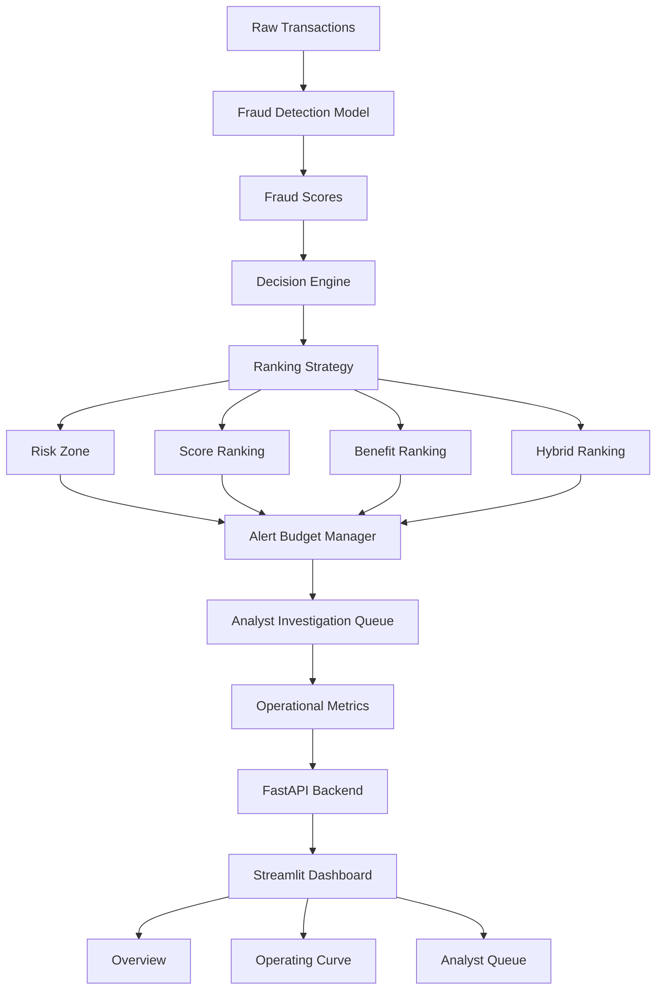

# Adaptive Fraud Intelligence


Decision-Centric Fraud Detection Framework for Adaptive Alert Selection, Cost Optimization, Analyst Prioritization, and Operational Monitoring

---

## Research Contribution

This project demonstrates how fraud-detection systems can be extended beyond predictive modeling by incorporating operational decision intelligence.

The framework introduces:

* Budget-aware alert selection
* Cost-sensitive fraud prioritization
* Analyst-centered investigation workflows
* Operational monitoring and simulation

The proposed architecture separates fraud prediction from fraud-response decision making, allowing organizations to optimize investigation resources while maximizing fraud detection effectiveness.

---

## Overview

Traditional fraud detection systems often optimize only predictive performance metrics such as ROC-AUC, Precision, Recall, and F1 Score.

This project focuses instead on operational fraud decision-making under real-world investigation constraints.

The system combines machine learning fraud scoring with adaptive decision logic, investigation-budget management, analyst prioritization, ranking strategies, and cost-aware alert selection to simulate realistic fraud operations workflows.

Instead of asking:

> "Which transactions are fraudulent?"

the system answers:

> "Which transactions should be investigated given operational constraints?"

---

## What Makes This Different?

Most fraud detection projects stop after generating fraud probabilities.

This project introduces a dedicated decision layer that transforms fraud predictions into operational actions.

The framework incorporates:

* Investigation-capacity constraints
* Analyst workload considerations
* Adaptive alert budgeting
* Cost-aware ranking
* Operational prioritization
* Monitoring and simulation

The objective is not only to identify fraud but also to optimize fraud-response decisions under realistic operational conditions.

---

## Key Capabilities

* Fraud Detection
* Decision Intelligence
* Adaptive Alert Selection
* Investigation Budget Optimization
* Analyst Queue Prioritization
* Cost-Aware Decision Making
* Operating Curve Optimization
* Sequential Fraud Simulation
* Real-Time Monitoring
* Scenario-Based Simulation
* Interactive Parameter Tuning
* Investigation-Capacity Modeling
* FastAPI Backend
* Streamlit Dashboard

---

## Core Objectives

* Detect fraudulent financial transactions
* Reduce total operational fraud cost
* Improve fraud recall under investigation constraints
* Prioritize analyst review queues intelligently
* Simulate adaptive fraud monitoring workflows
* Compare static threshold systems against adaptive decision systems
* Optimize investigation budgets
* Support operational fraud decision making

---

## Features

### Machine Learning Layer

* Fraud probability scoring
* Transaction risk estimation
* Feature engineering pipeline
* Probability calibration support
* Threshold evaluation

### Decision Intelligence Layer

* Adaptive alert budgeting
* Cost-aware fraud ranking
* Investigation-capacity-aware alert selection
* Static threshold vs adaptive strategy comparison
* Risk-zone transaction prioritization
* Alert suppression logic
* Decision-engine driven alert generation

### Ranking Strategies

Supported ranking policies:

* risk_zone
* score
* benefit
* hybrid

These strategies allow different operational approaches to fraud investigation prioritization.


### Simulation Settings

The platform allows users to simulate different fraud-operation environments through configurable decision parameters.

Available controls:

* Transaction Limit
* Investigation Cost per Alert
* Ranking Policy Selection
* Risk-Zone Threshold
* Alert Budget Multiplier

These controls enable experimentation with different operational scenarios and investigation-capacity constraints.

Examples:

* Increasing the alert budget captures more fraud but generates additional investigations.
* Raising the risk-zone threshold creates a stricter review process.
* Changing ranking policies alters analyst prioritization behavior.
* Increasing investigation cost changes cost-benefit optimization decisions.

The dashboard supports scenario-based experimentation, allowing users to explore how operational policies influence fraud-detection effectiveness, analyst workload, and resource utilization.


### Analyst Operations Layer

* Dynamic analyst queue generation
* High / Medium / Low severity classification
* Investigation prioritization
* Analyst workload simulation
* Operational review management

### Monitoring & Simulation

* Sequential fraud simulation
* Operating curve analysis
* Monitoring metrics
* Real-time simulation support
* Alert volume analysis
* Operational performance tracking
* Fraud recall monitoring
* Cost analysis
* Expected-benefit analysis
* Missed-fraud tracking
* False-positive monitoring

### Interfaces

* FastAPI backend
* Streamlit interactive dashboard

---

## Main Result

Compared to the static threshold baseline, the adaptive decision system achieved improved fraud recall while simultaneously reducing total operational cost.

Example simulation using 3,000 PaySim transactions.

| System           | Recall | Precision | Alerts | Total Cost |
| ---------------- | ------ | --------- | ------ | ---------- |
| Static Threshold | 0.625  | 0.033     | 303    | 600,060    |
| Decision System  | 0.875  | 0.038     | 372    | 552,563    |

Additional operational metrics evaluated by the framework:

* Frauds Caught
* Missed Frauds
* False Positives
* Alert Rate
* Investigation Cost
* Expected Fraud Loss Prevented
* Total Expected Benefit


### Operational Interpretation

The adaptive decision system investigates a larger number of alerts while prioritizing transactions with higher operational value.

Although alert volume increases, the reduction in missed fraud cases significantly lowers total operational cost.

This demonstrates that fraud operations should optimize decision outcomes rather than relying solely on predictive thresholds.

The framework therefore shifts the focus from model-centric evaluation to decision-centric optimization.

### Key Outcome

The adaptive decision engine:

* Increased fraud recall by 25%
* Reduced total operational cost
* Detected more fraud cases
* Maintained operationally manageable alert volumes
* Improved analyst prioritization efficiency

---

## Dashboard Preview

### Static Threshold vs Decision System

The interactive dashboard allows users to compare static and adaptive fraud-investigation strategies, evaluate operational trade-offs, and simulate analyst decision workflows under configurable investigation constraints.



---

### Operating Curve Analysis

Evaluates the effect of investigation-budget expansion on:

* Fraud Recall
* Alert Volume
* Investigation Cost
* Operational Efficiency



---

### System Design

Visualizes the end-to-end architecture of the fraud intelligence framework, including the predictive layer, decision engine, analyst operations layer, and monitoring components.



---

### Analyst Investigation Queue

Displays dynamically prioritized fraud alerts including:

* Fraud score
* Rank score
* Expected benefit
* Investigation cost
* Severity level
* Review reasoning




---

## System Architecture



The architecture separates prediction from decision-making.

The machine learning model produces fraud risk scores, while the decision engine converts those scores into operational alerts using adaptive budgets, ranking strategies, analyst-prioritization logic, and investigation-capacity constraints.

---

## Project Structure

```text
app/
├── api/
├── core/
├── model/
├── monitoring/
├── tests/
├── dashboard.py
├── main.py
└── streamlit_app.py

decisioning/
├── analyst_budget.py
├── cost_logic.py
├── decision_engine.py
├── strategies.py
├── suppression.py
└── thresholding.py

scripts/
├── check_cost_logic.py
├── check_decision_engine.py
├── check_end_to_end_decision.py
├── check_model_loading.py
├── check_thresholding.py
├── evaluate_decision_strategies.py
├── fraud_detection.py
├── plot_operating_curve.py
├── run_realtime_demo.py
└── run_sequential_simulation.py

config/
data/
docs/
logs/
models/
notebooks/
```

---

## Technologies

### Data Science & Machine Learning

* Python
* Pandas
* NumPy
* Scikit-Learn
* Matplotlib
* Joblib

### Backend & Dashboard

* FastAPI
* Streamlit

### Data Storage

* SQLite

### Development & Testing

* Git
* GitHub
* Pytest
* REST APIs

---

## How To Run

### Install dependencies

```bash
py -m pip install -r requirements.txt
```

### Add dataset

Place dataset here:

```text
data/raw/AIML Dataset.csv
```

### Run FastAPI backend

```bash
py -m uvicorn app.api.main:app --reload
```

Backend:

```text
http://127.0.0.1:8000
```

### Run Streamlit dashboard

```bash
py -m streamlit run app/dashboard.py
```

Dashboard:

```text
http://localhost:8501
```

---

## Dataset

This project uses the PaySim synthetic financial transaction dataset.

The dataset is not included in the repository due to size limitations.

Expected dataset path:

```text
data/raw/AIML Dataset.csv
```

---

## Future Improvements

* Concept drift detection
* Analyst feedback loops
* Online model retraining
* Dynamic queue allocation
* Real-time streaming integration
* Reinforcement-learning prioritization
* MLOps deployment pipeline
* Production monitoring

---

## Thesis Context

This repository was developed as part of a Master's thesis focused on decision-centric fraud detection, adaptive transaction prioritization, cost optimization, analyst queue management, and monitoring for real-time capable fraud systems.

The project explores how machine-learning predictions can be transformed into operational fraud decisions through adaptive prioritization, budget-aware alerting, analyst-centered investigation workflows, and decision-intelligence techniques designed for real-world fraud operations.
